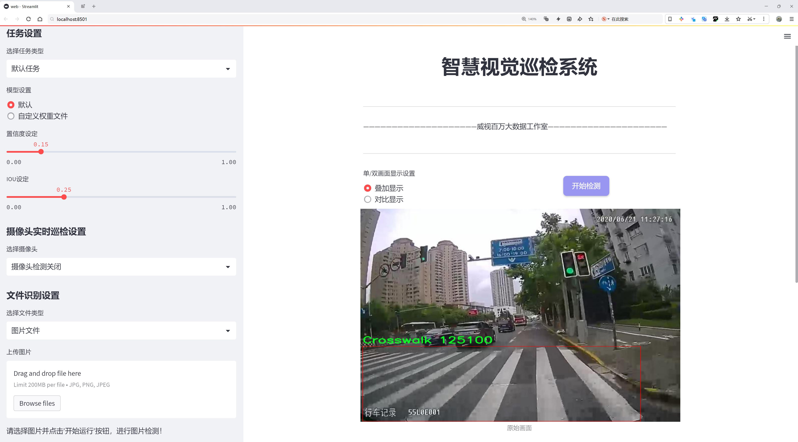
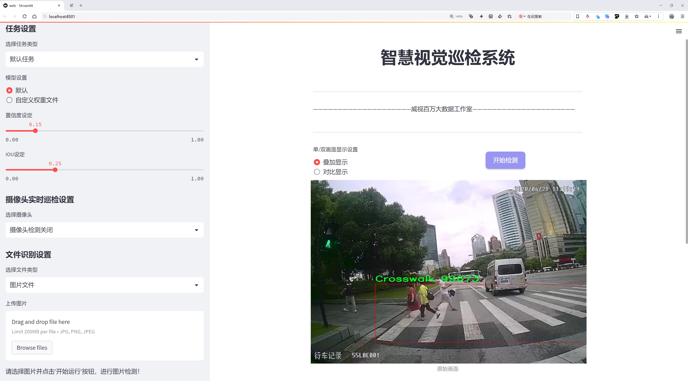
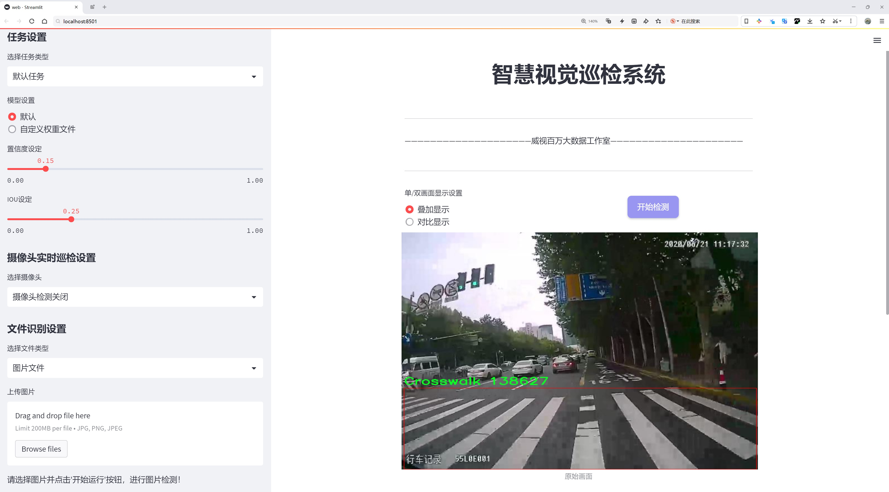
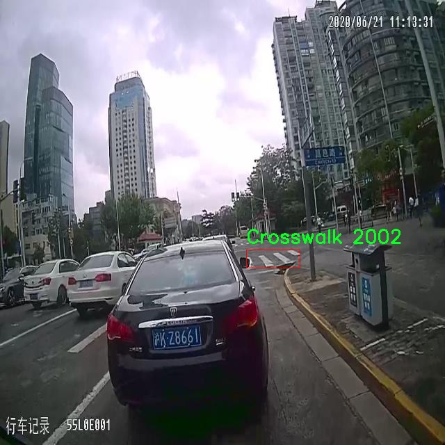
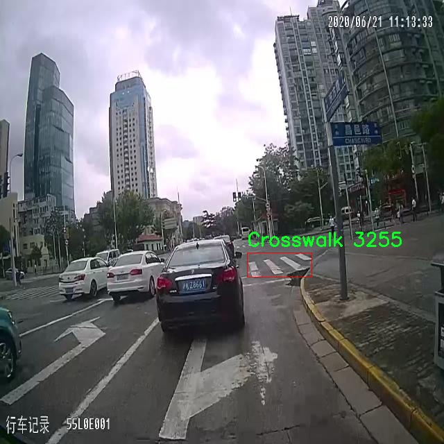
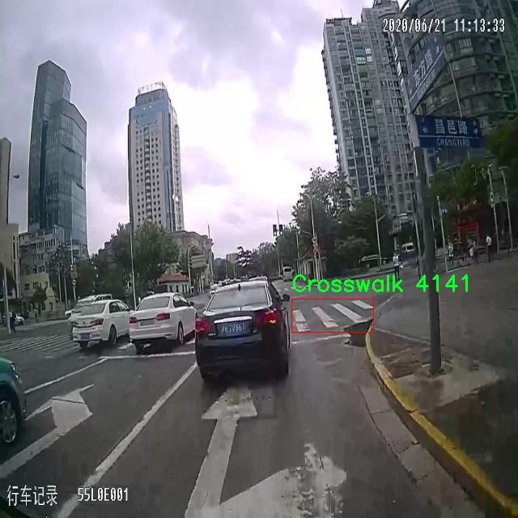
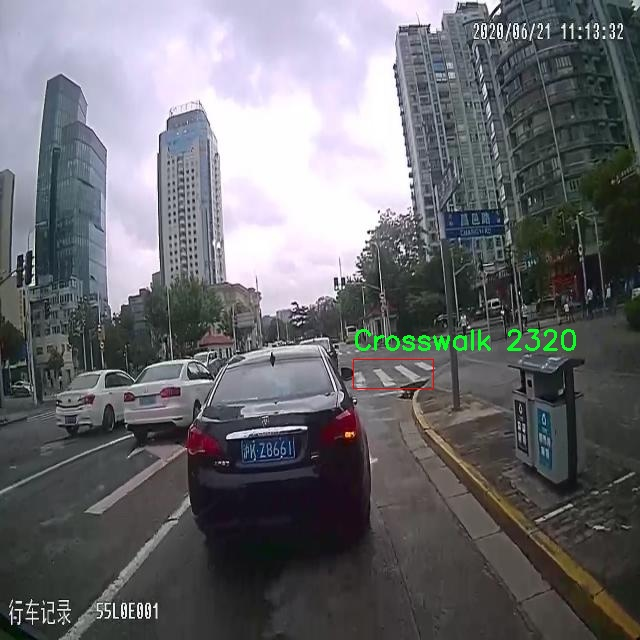
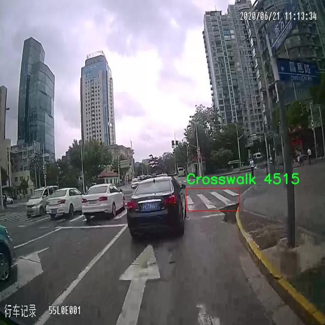

# 斑马线识别检测系统源码分享
 # [一条龙教学YOLOV8标注好的数据集一键训练_70+全套改进创新点发刊_Web前端展示]

### 1.研究背景与意义

项目参考[AAAI Association for the Advancement of Artificial Intelligence](https://gitee.com/qunmasj/projects)

项目来源[AACV Association for the Advancement of Computer Vision](https://github.com/qunshansj/good)

研究背景与意义

随着城市化进程的加快，交通安全问题日益凸显，尤其是在行人过马路的斑马线区域，交通事故频发，给行人带来了极大的安全隐患。因此，如何有效地识别和监测斑马线及其周边的交通状况，成为了智能交通系统研究中的一个重要课题。近年来，深度学习技术的迅猛发展为目标检测提供了新的解决方案，尤其是YOLO（You Only Look Once）系列模型在实时物体检测任务中表现出了优异的性能。YOLOv8作为该系列的最新版本，凭借其高效的特征提取能力和快速的推理速度，成为了斑马线识别系统的理想选择。

本研究旨在基于改进的YOLOv8模型，构建一个高效的斑马线识别系统。为实现这一目标，我们将使用CDNet_subset数据集，该数据集包含2935张图像，涵盖了“斑马线”和“导向箭头”两个类别。这一数据集的丰富性和多样性为模型的训练和测试提供了良好的基础。通过对该数据集的深入分析，我们可以更好地理解斑马线在不同环境和光照条件下的特征，从而提高模型的鲁棒性和准确性。

在交通管理中，斑马线的识别不仅仅是一个技术问题，更是一个社会问题。有效的斑马线识别系统能够实时监测行人过马路的情况，及时向驾驶员发出警示，从而降低交通事故的发生率。此外，该系统还可以为城市交通管理提供数据支持，帮助交通管理部门进行科学决策，优化交通流量，提高城市交通的整体效率。

通过对YOLOv8模型的改进，我们将引入新的特征提取方法和数据增强技术，以提高模型在斑马线识别任务中的性能。具体而言，我们将针对斑马线的形状、颜色和纹理等特征进行深入研究，优化模型的参数设置，以实现更高的检测精度和更快的处理速度。同时，考虑到实际应用场景中的复杂性，我们还将探讨如何将该系统与其他交通监测系统进行集成，实现多种交通信息的综合分析。

综上所述，基于改进YOLOv8的斑马线识别系统的研究不仅具有重要的学术价值，也具有广泛的社会应用前景。通过提高斑马线的识别率，我们可以有效地提升行人过马路的安全性，减少交通事故的发生，进而为构建安全、智能的城市交通环境贡献力量。这一研究不仅为交通安全领域提供了新的技术手段，也为后续的相关研究奠定了基础，具有重要的理论意义和实践价值。

### 2.图片演示







##### 注意：由于此博客编辑较早，上面“2.图片演示”和“3.视频演示”展示的系统图片或者视频可能为老版本，新版本在老版本的基础上升级如下：（实际效果以升级的新版本为准）

  （1）适配了YOLOV8的“目标检测”模型和“实例分割”模型，通过加载相应的权重（.pt）文件即可自适应加载模型。

  （2）支持“图片识别”、“视频识别”、“摄像头实时识别”三种识别模式。

  （3）支持“图片识别”、“视频识别”、“摄像头实时识别”三种识别结果保存导出，解决手动导出（容易卡顿出现爆内存）存在的问题，识别完自动保存结果并导出到tempDir中。

  （4）支持Web前端系统中的标题、背景图等自定义修改，后面提供修改教程。

  另外本项目提供训练的数据集和训练教程,暂不提供权重文件（best.pt）,需要您按照教程进行训练后实现图片演示和Web前端界面演示的效果。

### 3.视频演示

[3.1 视频演示](https://www.bilibili.com/video/BV1SSHPerEV9/?vd_source=ff015de2d29cbe2a9cdbfa7064407a08)

### 4.数据集信息展示

数据集信息展示

在本研究中，我们采用了名为“CDNet_subset”的数据集，以改进YOLOv8的斑马线识别系统。该数据集专注于单一类别的目标检测，具体类别为“Crosswalk”，即斑马线。这一选择反映了我们对斑马线识别任务的专注，旨在提高自动驾驶和交通监控系统中斑马线检测的准确性和鲁棒性。

“CDNet_subset”数据集的构建旨在提供一个高质量的图像集，以支持深度学习模型的训练和验证。数据集中包含了多种场景下的斑马线图像，这些图像来源于不同的城市环境、天气条件和时间段，确保了数据的多样性和代表性。通过这种方式，我们希望模型能够学习到斑马线在各种背景下的特征，从而在实际应用中表现出更好的适应性。

在数据集的图像标注方面，所有的斑马线均经过精确的标注，确保了训练过程中使用的标签的准确性。这种高质量的标注对于深度学习模型的训练至关重要，因为它直接影响到模型的学习效果和最终的检测性能。通过使用精确的边界框，我们的模型能够更好地理解斑马线的形状、位置以及与周围环境的关系。

此外，数据集还考虑到了不同的视角和拍摄角度，涵盖了正面、侧面和斜侧面等多种视角的斑马线图像。这种多样化的视角有助于模型在实际应用中处理不同的视觉输入，增强其在复杂场景下的识别能力。例如，在城市交通中，斑马线可能被其他物体遮挡或处于不同的光照条件下，模型需要具备足够的灵活性来应对这些挑战。

为了进一步提升模型的性能，我们在数据预处理阶段进行了多种增强操作，包括图像的旋转、缩放、裁剪和颜色调整等。这些增强操作不仅增加了数据集的规模，还帮助模型在训练过程中学习到更为丰富的特征，从而提高其泛化能力。通过这种方式，我们希望在训练结束后，模型能够在未见过的图像上也能保持较高的识别准确率。

在评估阶段，我们将使用标准的指标来衡量模型在斑马线识别任务中的表现，包括准确率、召回率和F1-score等。这些指标将为我们提供模型性能的全面视角，帮助我们判断改进措施的有效性。同时，我们也将与现有的斑马线识别系统进行对比，以验证我们的方法在实际应用中的优势。

综上所述，“CDNet_subset”数据集为改进YOLOv8的斑马线识别系统提供了坚实的基础。通过精心设计的数据集和系统的训练策略，我们期望能够显著提升斑马线的检测性能，为智能交通系统的发展贡献力量。











### 5.全套项目环境部署视频教程（零基础手把手教学）

[5.1 环境部署教程链接（零基础手把手教学）](https://www.ixigua.com/7404473917358506534?logTag=c807d0cbc21c0ef59de5)


[5.2 安装Python虚拟环境创建和依赖库安装视频教程链接（零基础手把手教学）](https://www.ixigua.com/7404474678003106304?logTag=1f1041108cd1f708b01a)

### 6.手把手YOLOV8训练视频教程（零基础小白有手就能学会）

[6.1 环境部署教程链接（零基础手把手教学）](https://www.ixigua.com/7404477157818401292?logTag=d31a2dfd1983c9668658)

### 7.70+种全套YOLOV8创新点代码加载调参视频教程（一键加载写好的改进模型的配置文件）

[7.1 环境部署教程链接（零基础手把手教学）](https://www.ixigua.com/7404478314661806627?logTag=29066f8288e3f4eea3a4)

### 8.70+种全套YOLOV8创新点原理讲解（非科班也可以轻松写刊发刊，V10版本正在科研待更新）

由于篇幅限制，每个创新点的具体原理讲解就不一一展开，具体见下列网址中的创新点对应子项目的技术原理博客网址【Blog】：


[8.1 70+种全套YOLOV8创新点原理讲解链接](https://gitee.com/qunmasj/good)

### 9.系统功能展示（检测对象为举例，实际内容以本项目数据集为准）

图9.1.系统支持检测结果表格显示

  图9.2.系统支持置信度和IOU阈值手动调节

  图9.3.系统支持自定义加载权重文件best.pt(需要你通过步骤5中训练获得)

  图9.4.系统支持摄像头实时识别

  图9.5.系统支持图片识别

  图9.6.系统支持视频识别

  图9.7.系统支持识别结果文件自动保存

  图9.8.系统支持Excel导出检测结果数据


### 10.原始YOLOV8算法原理

原始YOLOv8算法原理

YOLOv8作为YOLO系列中的最新版本，于2023年1月10日正式推出，标志着计算机视觉领域目标检测技术的又一次飞跃。它不仅在检测精度和执行速度上超越了前代模型，更在架构设计上进行了深刻的创新与优化，使其成为当前最先进的目标检测和实例分割模型之一。YOLOv8的设计理念继承了YOLOv5、YOLOv6和YOLOX等前辈模型的优点，同时在此基础上进行了全方位的改进，旨在提升模型的性能和适用性。

YOLOv8的网络结构主要分为四个部分：输入端、骨干网络、颈部网络和头部网络。输入端采用了马赛克数据增强、自适应锚框计算和自适应灰度填充等技术，以提高模型对多样化输入的适应能力。骨干网络则是YOLOv8的核心部分，采用了CSPDarknet结构，其中C2f模块的引入使得模型在特征提取时能够更有效地学习残差特征。C2f模块通过增加跳层连接和分支操作，增强了梯度流的传递，进而提升了特征表示能力。这种设计使得YOLOv8在处理复杂场景时，能够更好地捕捉到目标的细节信息。

在颈部网络中，YOLOv8采用了路径聚合网络（PAN）结构，这一结构的设计目的是加强不同尺度对象特征的融合能力。通过有效地整合来自不同层次的特征，YOLOv8能够在多尺度目标检测中表现出色，尤其是在小目标和高分辨率图像的检测任务中，显示出了明显的优势。头部网络则是YOLOv8的一大创新之处，其将传统的耦合头结构改为解耦头结构，极大地提高了模型的灵活性和效率。通过将分类和回归过程分开，YOLOv8能够更精准地进行目标检测，同时减少了锚框的使用，使得检测过程更加高效。

YOLOv8在损失函数的设计上也进行了重要的创新。模型采用了Task-Aligned Assigner策略，根据分类与回归的分数加权结果选择正样本，确保了正负样本的合理分配。损失计算过程中，分类分支使用了二元交叉熵损失，而回归分支则结合了分布焦点损失和完全交并比损失函数。这种多样化的损失计算方式使得YOLOv8在边界框预测的准确性上有了显著提升。

值得一提的是，YOLOv8在模型的轻量化和高效性方面也做出了诸多努力。通过调整骨干网络中C2f模块的结构和数量，YOLOv8实现了更高的特征提取效率和更低的计算成本。此外，YOLOv8在不同规模的模型中进行了通道数的精简和调整，以适应不同的应用场景。比如，YOLOv8n作为参数量最小、检测速度最快的版本，特别适合实时性要求高的应用场景。

在实际应用中，YOLOv8展现出了极强的灵活性和适应性。无论是在垃圾分类、行人检测还是交通标志识别等多种任务中，YOLOv8都能够提供高精度的检测结果。其在COCOVal2017数据集上的表现也证明了其卓越的性能，YOLOv8n模型在每张图的识别准确性和训练速度上均优于YOLOv5，展现了其在目标检测领域的领先地位。

总的来说，YOLOv8不仅是YOLO系列的最新力作，更是目标检测技术的一次重大进步。通过对网络结构的深度优化、损失函数的创新设计以及对模型轻量化的持续追求，YOLOv8在保证高精度的同时，也实现了更快的检测速度。这使得YOLOv8在计算机视觉领域中，尤其是在实时目标检测和实例分割任务中，成为了一个不可或缺的工具。随着YOLOv8的广泛应用，未来的目标检测技术将迎来更加广阔的发展前景。


### 11.项目核心源码讲解（再也不用担心看不懂代码逻辑）

#### 11.1 ui.py

以下是对代码的核心部分进行保留和详细注释的版本：

```python
import sys
import subprocess

def run_script(script_path):
    """
    使用当前 Python 环境运行指定的脚本。

    Args:
        script_path (str): 要运行的脚本路径

    Returns:
        None
    """
    # 获取当前 Python 解释器的路径
    python_path = sys.executable

    # 构建运行命令，使用 streamlit 运行指定的脚本
    command = f'"{python_path}" -m streamlit run "{script_path}"'

    # 执行命令
    result = subprocess.run(command, shell=True)
    
    # 检查命令执行结果，如果返回码不为0，表示执行出错
    if result.returncode != 0:
        print("脚本运行出错。")

# 实例化并运行应用
if __name__ == "__main__":
    # 指定要运行的脚本路径
    script_path = "web.py"  # 这里可以直接指定脚本名，假设它在当前目录下

    # 运行指定的脚本
    run_script(script_path)
```

### 代码核心部分分析：

1. **导入模块**：
   - `sys`：用于获取当前 Python 解释器的路径。
   - `subprocess`：用于执行外部命令。

2. **`run_script` 函数**：
   - 接受一个参数 `script_path`，表示要运行的 Python 脚本的路径。
   - 使用 `sys.executable` 获取当前 Python 解释器的路径，以确保使用正确的 Python 环境。
   - 构建一个命令字符串，使用 `streamlit` 运行指定的脚本。
   - 使用 `subprocess.run` 执行命令，并检查返回码以判断脚本是否成功运行。

3. **主程序入口**：
   - 在 `if __name__ == "__main__":` 块中，指定要运行的脚本路径，并调用 `run_script` 函数来执行该脚本。

### 备注：
- 代码中使用了 `streamlit`，这是一个用于构建数据应用的框架，脚本 `web.py` 应该是一个 Streamlit 应用。
- 通过使用 `subprocess.run`，可以在当前 Python 环境中执行其他 Python 脚本，并且能够捕获执行结果。

这个程序文件 `ui.py` 是一个用于运行指定 Python 脚本的简单工具，主要是通过调用 `subprocess` 模块来执行一个 Streamlit 应用。首先，文件导入了必要的模块，包括 `sys`、`os` 和 `subprocess`，其中 `sys` 用于获取当前 Python 解释器的路径，`subprocess` 用于执行外部命令。

在文件中定义了一个名为 `run_script` 的函数，该函数接受一个参数 `script_path`，表示要运行的脚本的路径。函数内部首先获取当前 Python 解释器的路径，并使用这个路径构建一个命令字符串，命令的格式是使用 Python 解释器运行 Streamlit 应用。具体来说，命令是通过 `-m streamlit run` 来启动指定的脚本。

接下来，使用 `subprocess.run` 方法执行构建好的命令。这个方法会在 shell 中运行命令，并返回一个结果对象。通过检查 `result.returncode`，可以判断脚本是否成功运行。如果返回码不为 0，表示运行过程中出现了错误，此时会打印出“脚本运行出错”的提示信息。

在文件的最后部分，使用 `if __name__ == "__main__":` 语句来确保当该文件作为主程序运行时，才会执行下面的代码。这里指定了要运行的脚本路径，调用 `abs_path` 函数来获取 `web.py` 的绝对路径，然后调用 `run_script` 函数来执行这个脚本。

总的来说，这个文件的主要功能是为运行一个 Streamlit 应用提供一个简单的接口，通过指定脚本路径来启动相应的 Web 应用。

#### 11.2 ultralytics\utils\callbacks\base.py

以下是代码中最核心的部分，并附上详细的中文注释：

```python
from collections import defaultdict
from copy import deepcopy

# 默认回调函数字典，包含了训练、验证、预测和导出过程中的回调函数
default_callbacks = {
    # 训练过程中的回调
    "on_pretrain_routine_start": [on_pretrain_routine_start],  # 预训练开始时调用
    "on_pretrain_routine_end": [on_pretrain_routine_end],      # 预训练结束时调用
    "on_train_start": [on_train_start],                          # 训练开始时调用
    "on_train_epoch_start": [on_train_epoch_start],            # 每个训练周期开始时调用
    "on_train_batch_start": [on_train_batch_start],            # 每个训练批次开始时调用
    "optimizer_step": [optimizer_step],                          # 优化器步进时调用
    "on_before_zero_grad": [on_before_zero_grad],              # 在梯度归零之前调用
    "on_train_batch_end": [on_train_batch_end],                # 每个训练批次结束时调用
    "on_train_epoch_end": [on_train_epoch_end],                # 每个训练周期结束时调用
    "on_fit_epoch_end": [on_fit_epoch_end],                    # 每个拟合周期结束时调用（训练 + 验证）
    "on_model_save": [on_model_save],                          # 模型保存时调用
    "on_train_end": [on_train_end],                            # 训练结束时调用
    "on_params_update": [on_params_update],                    # 模型参数更新时调用
    "teardown": [teardown],                                    # 训练过程清理时调用
    # 验证过程中的回调
    "on_val_start": [on_val_start],                            # 验证开始时调用
    "on_val_batch_start": [on_val_batch_start],                # 每个验证批次开始时调用
    "on_val_batch_end": [on_val_batch_end],                    # 每个验证批次结束时调用
    "on_val_end": [on_val_end],                                # 验证结束时调用
    # 预测过程中的回调
    "on_predict_start": [on_predict_start],                    # 预测开始时调用
    "on_predict_batch_start": [on_predict_batch_start],        # 每个预测批次开始时调用
    "on_predict_batch_end": [on_predict_batch_end],            # 每个预测批次结束时调用
    "on_predict_postprocess_end": [on_predict_postprocess_end],# 预测后处理结束时调用
    "on_predict_end": [on_predict_end],                        # 预测结束时调用
    # 导出过程中的回调
    "on_export_start": [on_export_start],                      # 模型导出开始时调用
    "on_export_end": [on_export_end],                          # 模型导出结束时调用
}

def get_default_callbacks():
    """
    返回一个默认回调字典的副本，字典的值为默认空列表。

    返回:
        (defaultdict): 一个defaultdict，包含default_callbacks中的键和空列表作为默认值。
    """
    return defaultdict(list, deepcopy(default_callbacks))

def add_integration_callbacks(instance):
    """
    将来自不同来源的集成回调添加到实例的回调中。

    参数:
        instance (Trainer, Predictor, Validator, Exporter): 一个具有'callbacks'属性的对象，该属性是一个回调列表的字典。
    """
    # 加载HUB回调
    from .hub import callbacks as hub_cb

    callbacks_list = [hub_cb]

    # 如果实例是Trainer类，则加载训练回调
    if "Trainer" in instance.__class__.__name__:
        from .clearml import callbacks as clear_cb
        from .comet import callbacks as comet_cb
        from .dvc import callbacks as dvc_cb
        from .mlflow import callbacks as mlflow_cb
        from .neptune import callbacks as neptune_cb
        from .raytune import callbacks as tune_cb
        from .tensorboard import callbacks as tb_cb
        from .wb import callbacks as wb_cb

        # 将所有训练回调添加到回调列表中
        callbacks_list.extend([clear_cb, comet_cb, dvc_cb, mlflow_cb, neptune_cb, tune_cb, tb_cb, wb_cb])

    # 将回调添加到实例的回调字典中
    for callbacks in callbacks_list:
        for k, v in callbacks.items():
            if v not in instance.callbacks[k]:
                instance.callbacks[k].append(v)
```

### 代码核心部分解释：
1. **default_callbacks**: 这是一个字典，定义了在不同训练、验证、预测和导出阶段的回调函数。每个回调函数在特定事件发生时被调用，以便执行相应的操作。
  
2. **get_default_callbacks**: 这个函数返回一个`defaultdict`，它是`default_callbacks`的深拷贝，确保每个键都有一个空列表作为默认值。

3. **add_integration_callbacks**: 这个函数用于将不同来源的回调函数集成到给定实例的回调字典中。它根据实例的类型（如训练器、预测器等）加载相应的回调，并确保不会重复添加相同的回调。

这个程序文件是Ultralytics YOLO项目中的一个基础回调函数模块，主要用于在训练、验证、预测和导出模型的不同阶段触发特定的回调函数。文件中定义了一系列的回调函数，这些函数在特定的事件发生时被调用，以便执行相应的操作或记录状态。

文件的开头部分导入了`defaultdict`和`deepcopy`，这两个模块分别用于创建一个具有默认值的字典和深拷贝对象。接下来，定义了一系列与训练相关的回调函数，例如在预训练开始和结束时、训练开始、每个训练周期和批次开始和结束时、优化器步进、梯度清零前、模型保存、训练结束等时刻调用的函数。这些函数目前都是空的，意味着它们可以被重写以实现具体的功能。

同样，文件中还定义了一些与验证相关的回调函数，例如在验证开始、每个验证批次开始和结束时、验证结束时调用的函数。预测相关的回调函数也被定义，包括在预测开始、每个预测批次开始和结束时、后处理结束时、预测结束时调用的函数。

此外，还有导出相关的回调函数，用于在模型导出开始和结束时调用。所有这些回调函数的目的是为用户提供在模型训练、验证、预测和导出过程中插入自定义逻辑的机会。

在文件的最后部分，定义了一个`default_callbacks`字典，包含了所有回调函数的名称和对应的函数列表。`get_default_callbacks`函数返回一个深拷贝的`default_callbacks`字典，确保每次调用时都得到一个新的字典实例。

最后，`add_integration_callbacks`函数用于将来自不同来源的集成回调添加到给定实例的回调字典中。这个函数首先加载一些外部回调模块，然后根据实例的类型（如训练器、预测器、验证器或导出器）选择性地添加相应的回调。这种设计使得回调系统具有很好的扩展性和灵活性，用户可以根据需要添加或修改回调函数，以适应不同的训练和验证需求。

#### 11.3 ultralytics\models\fastsam\model.py

```python
# 引入所需的库
from pathlib import Path
from ultralytics.engine.model import Model
from .predict import FastSAMPredictor
from .val import FastSAMValidator

class FastSAM(Model):
    """
    FastSAM模型接口。

    示例用法：
        ```python
        from ultralytics import FastSAM

        model = FastSAM('last.pt')  # 加载模型
        results = model.predict('ultralytics/assets/bus.jpg')  # 进行预测
        ```
    """

    def __init__(self, model="FastSAM-x.pt"):
        """初始化FastSAM类，调用父类（YOLO）的__init__方法，并设置默认模型。"""
        # 如果传入的模型名为"FastSAM.pt"，则将其替换为"FastSAM-x.pt"
        if str(model) == "FastSAM.pt":
            model = "FastSAM-x.pt"
        # 确保传入的模型文件名后缀不是.yaml或.yml，FastSAM模型只支持预训练模型
        assert Path(model).suffix not in (".yaml", ".yml"), "FastSAM models only support pre-trained models."
        # 调用父类的初始化方法，设置模型和任务类型为"segment"
        super().__init__(model=model, task="segment")

    @property
    def task_map(self):
        """返回一个字典，将分割任务映射到相应的预测器和验证器类。"""
        return {"segment": {"predictor": FastSAMPredictor, "validator": FastSAMValidator}}
```

### 代码核心部分说明：
1. **类定义**：`FastSAM`类继承自`Model`类，表示一个特定的模型接口。
2. **初始化方法**：`__init__`方法用于初始化模型，确保模型文件的正确性，并调用父类的初始化方法。
3. **任务映射**：`task_map`属性返回一个字典，定义了与分割任务相关的预测器和验证器类。

这个程序文件定义了一个名为 `FastSAM` 的类，它是 Ultralytics YOLO 框架中的一个模型接口，主要用于图像分割任务。首先，文件引入了必要的模块，包括 `Path` 类用于处理文件路径，以及从 `ultralytics.engine.model` 导入的 `Model` 类，这个类是 FastSAM 的父类。

在 `FastSAM` 类的文档字符串中，提供了一个简单的使用示例，展示了如何实例化模型并进行预测。用户可以通过传入模型文件的路径（例如 'last.pt'）来创建 `FastSAM` 对象，并使用 `predict` 方法对指定的图像文件（如 'ultralytics/assets/bus.jpg'）进行预测。

构造函数 `__init__` 中，首先检查传入的模型文件名，如果是 "FastSAM.pt"，则将其替换为 "FastSAM-x.pt"。接着，使用 `assert` 语句确保传入的模型文件后缀不是 YAML 格式，因为 FastSAM 模型只支持预训练模型。最后，调用父类 `Model` 的构造函数，传入模型路径和任务类型（此处为 "segment"）。

此外，`FastSAM` 类还定义了一个名为 `task_map` 的属性，它返回一个字典，映射了分割任务到相应的预测器和验证器类。这个字典中，"segment" 任务对应的预测器是 `FastSAMPredictor`，验证器是 `FastSAMValidator`。这样设计使得模型在处理不同任务时能够灵活地选择合适的组件。整体来看，这个文件为 FastSAM 模型的使用和扩展提供了基础框架。

#### 11.4 ultralytics\models\yolo\obb\val.py

以下是代码中最核心的部分，并附上详细的中文注释：

```python
class OBBValidator(DetectionValidator):
    """
    OBBValidator类扩展了DetectionValidator类，用于基于定向边界框（OBB）模型的验证。
    """

    def __init__(self, dataloader=None, save_dir=None, pbar=None, args=None, _callbacks=None):
        """初始化OBBValidator并将任务设置为'obb'，指标设置为OBBMetrics。"""
        super().__init__(dataloader, save_dir, pbar, args, _callbacks)
        self.args.task = "obb"  # 设置任务类型为OBB
        self.metrics = OBBMetrics(save_dir=self.save_dir, plot=True, on_plot=self.on_plot)  # 初始化OBB指标

    def postprocess(self, preds):
        """对预测输出应用非极大值抑制（NMS）。"""
        return ops.non_max_suppression(
            preds,
            self.args.conf,  # 置信度阈值
            self.args.iou,   # IOU阈值
            labels=self.lb,  # 标签
            nc=self.nc,      # 类别数量
            multi_label=True,  # 是否支持多标签
            agnostic=self.args.single_cls,  # 是否单类
            max_det=self.args.max_det,  # 最大检测数量
            rotated=True,  # 是否支持旋转
        )

    def _process_batch(self, detections, gt_bboxes, gt_cls):
        """
        返回正确的预测矩阵。

        参数:
            detections (torch.Tensor): 形状为[N, 6]的张量，表示检测结果。
                每个检测的格式为: x1, y1, x2, y2, conf, class。
            gt_bboxes (torch.Tensor): 形状为[M, 5]的张量，表示真实标签。
                每个标签的格式为: class, x1, y1, x2, y2。

        返回:
            (torch.Tensor): 形状为[N, 10]的正确预测矩阵，包含10个IOU水平。
        """
        iou = batch_probiou(gt_bboxes, torch.cat([detections[:, :4], detections[:, -1:]], dim=-1))  # 计算IOU
        return self.match_predictions(detections[:, 5], gt_cls, iou)  # 匹配预测与真实标签

    def plot_predictions(self, batch, preds, ni):
        """在输入图像上绘制预测的边界框并保存结果。"""
        plot_images(
            batch["img"],  # 输入图像
            *output_to_rotated_target(preds, max_det=self.args.max_det),  # 转换预测为旋转目标
            paths=batch["im_file"],  # 图像文件路径
            fname=self.save_dir / f"val_batch{ni}_pred.jpg",  # 保存文件名
            names=self.names,  # 类别名称
            on_plot=self.on_plot,  # 是否在图上绘制
        )

    def eval_json(self, stats):
        """评估YOLO输出的JSON格式并返回性能统计信息。"""
        if self.args.save_json and self.is_dota and len(self.jdict):
            import json
            import re
            from collections import defaultdict

            pred_json = self.save_dir / "predictions.json"  # 预测结果JSON文件
            pred_txt = self.save_dir / "predictions_txt"  # 预测结果TXT文件
            pred_txt.mkdir(parents=True, exist_ok=True)  # 创建目录
            data = json.load(open(pred_json))  # 加载JSON数据

            # 保存分割结果
            for d in data:
                image_id = d["image_id"]
                score = d["score"]
                classname = self.names[d["category_id"]].replace(" ", "-")
                p = d["poly"]

                with open(f'{pred_txt / f"Task1_{classname}"}.txt', "a") as f:
                    f.writelines(f"{image_id} {score} {p[0]} {p[1]} {p[2]} {p[3]} {p[4]} {p[5]} {p[6]} {p[7]}\n")

        return stats  # 返回统计信息
```

### 代码核心部分说明：
1. **类定义**：`OBBValidator`类用于处理基于定向边界框的目标检测验证，继承自`DetectionValidator`。
2. **初始化方法**：在初始化时设置任务类型为OBB，并初始化相关的性能指标。
3. **后处理方法**：对模型的预测结果应用非极大值抑制，以去除冗余的检测框。
4. **批处理方法**：处理一批检测结果，计算与真实标签的IOU，并返回匹配的预测结果。
5. **绘图方法**：将预测的边界框绘制在输入图像上，并保存结果。
6. **评估方法**：将预测结果以JSON格式保存，并进行统计分析。

这些核心部分是进行目标检测验证的基础，涵盖了模型初始化、预测处理、结果可视化和评估等关键步骤。

这个程序文件是Ultralytics YOLO模型的一个验证器，专门用于基于定向边界框（OBB）模型的验证。文件中定义了一个名为`OBBValidator`的类，该类继承自`DetectionValidator`，并重写了一些方法以适应OBB的特性。

在初始化方法中，`OBBValidator`设置了任务类型为“obb”，并初始化了用于评估的指标`OBBMetrics`。这使得该验证器能够计算与OBB相关的性能指标。

`init_metrics`方法用于初始化YOLO的评估指标，并判断数据集是否为DOTA格式。`postprocess`方法应用非极大值抑制（NMS）来处理预测输出，以减少重叠的边界框。

`_process_batch`方法处理一批检测结果，计算与真实边界框的交并比（IoU），并返回正确的预测矩阵。`_prepare_batch`和`_prepare_pred`方法分别用于准备输入数据和预测结果，以适应OBB验证的需求。

`plot_predictions`方法用于将预测的边界框绘制在输入图像上，并保存结果。`pred_to_json`方法将YOLO的预测结果序列化为COCO格式的JSON文件，方便后续分析。

`save_one_txt`方法将YOLO的检测结果保存为特定格式的文本文件，支持归一化坐标。`eval_json`方法用于评估YOLO输出的JSON格式，并返回性能统计信息。如果设置了保存JSON并且数据集为DOTA格式，它会将预测结果保存为DOTA格式的文本文件，并处理合并结果。

整个程序的设计旨在提供一个灵活的框架，用于验证和评估基于OBB的目标检测模型，支持多种数据格式和输出方式，便于用户进行后续分析和结果处理。

#### 11.5 ultralytics\utils\callbacks\clearml.py

以下是经过简化并注释的核心代码部分：

```python
# 导入必要的库
from ultralytics.utils import LOGGER, SETTINGS, TESTS_RUNNING

# 尝试导入 ClearML 库并进行一些基本的验证
try:
    assert not TESTS_RUNNING  # 确保不是在运行测试
    assert SETTINGS["clearml"] is True  # 确保 ClearML 集成已启用
    import clearml
    from clearml import Task
    from clearml.binding.frameworks.pytorch_bind import PatchPyTorchModelIO
    from clearml.binding.matplotlib_bind import PatchedMatplotlib

    assert hasattr(clearml, "__version__")  # 确保 ClearML 是一个有效的包

except (ImportError, AssertionError):
    clearml = None  # 如果导入失败，则将 clearml 设置为 None


def _log_debug_samples(files, title="Debug Samples") -> None:
    """
    将文件（图像）作为调试样本记录到 ClearML 任务中。

    参数:
        files (list): PosixPath 格式的文件路径列表。
        title (str): 用于分组具有相同值的图像的标题。
    """
    import re

    task = Task.current_task()  # 获取当前任务
    if task:  # 如果当前任务存在
        for f in files:  # 遍历文件列表
            if f.exists():  # 检查文件是否存在
                it = re.search(r"_batch(\d+)", f.name)  # 从文件名中提取批次信息
                iteration = int(it.groups()[0]) if it else 0  # 获取迭代次数
                task.get_logger().report_image(  # 记录图像
                    title=title, series=f.name.replace(it.group(), ""), local_path=str(f), iteration=iteration
                )


def on_pretrain_routine_start(trainer):
    """在预训练例程开始时运行；初始化并连接/记录任务到 ClearML。"""
    try:
        task = Task.current_task()  # 获取当前任务
        if task:  # 如果当前任务存在
            # 禁用自动的 PyTorch 和 Matplotlib 绑定
            PatchPyTorchModelIO.update_current_task(None)
            PatchedMatplotlib.update_current_task(None)
        else:  # 如果没有当前任务，则初始化一个新任务
            task = Task.init(
                project_name=trainer.args.project or "YOLOv8",  # 项目名称
                task_name=trainer.args.name,  # 任务名称
                tags=["YOLOv8"],  # 标签
                output_uri=True,
                reuse_last_task_id=False,
                auto_connect_frameworks={"pytorch": False, "matplotlib": False},  # 禁用自动连接
            )
            LOGGER.warning("ClearML Initialized a new task.")  # 记录警告信息
        task.connect(vars(trainer.args), name="General")  # 连接训练参数
    except Exception as e:
        LOGGER.warning(f"WARNING ⚠️ ClearML installed but not initialized correctly, not logging this run. {e}")


def on_train_epoch_end(trainer):
    """在 YOLO 训练的每个 epoch 结束时记录调试样本并报告当前训练进度。"""
    task = Task.current_task()  # 获取当前任务
    if task:  # 如果当前任务存在
        if trainer.epoch == 1:  # 仅在第一个 epoch 记录调试样本
            _log_debug_samples(sorted(trainer.save_dir.glob("train_batch*.jpg")), "Mosaic")  # 记录调试样本
        # 报告当前训练进度
        for k, v in trainer.label_loss_items(trainer.tloss, prefix="train").items():
            task.get_logger().report_scalar("train", k, v, iteration=trainer.epoch)  # 记录损失
        for k, v in trainer.lr.items():
            task.get_logger().report_scalar("lr", k, v, iteration=trainer.epoch)  # 记录学习率


def on_train_end(trainer):
    """在训练完成时记录最终模型及其名称。"""
    task = Task.current_task()  # 获取当前任务
    if task:  # 如果当前任务存在
        # 记录最终结果，包括混淆矩阵和 PR 曲线
        files = [
            "results.png",
            "confusion_matrix.png",
            "confusion_matrix_normalized.png",
            *(f"{x}_curve.png" for x in ("F1", "PR", "P", "R")),
        ]
        files = [(trainer.save_dir / f) for f in files if (trainer.save_dir / f).exists()]  # 过滤存在的文件
        for f in files:
            _log_plot(title=f.stem, plot_path=f)  # 记录图像
        # 报告最终指标
        for k, v in trainer.validator.metrics.results_dict.items():
            task.get_logger().report_single_value(k, v)  # 记录指标
        # 记录最终模型
        task.update_output_model(model_path=str(trainer.best), model_name=trainer.args.name, auto_delete_file=False)


# 定义回调函数
callbacks = (
    {
        "on_pretrain_routine_start": on_pretrain_routine_start,
        "on_train_epoch_end": on_train_epoch_end,
        "on_train_end": on_train_end,
    }
    if clearml
    else {}
)
```

### 代码注释说明：
1. **导入库**：导入必要的库和模块，确保 ClearML 的集成和功能可用。
2. **异常处理**：在导入时进行异常处理，确保在未能导入 ClearML 时不会导致程序崩溃。
3. **记录调试样本**：定义 `_log_debug_samples` 函数用于记录图像文件，以便在 ClearML 中进行调试。
4. **任务初始化**：在 `on_pretrain_routine_start` 函数中初始化 ClearML 任务，连接训练参数。
5. **训练进度记录**：在每个训练 epoch 结束时记录损失和学习率等信息。
6. **训练结束处理**：在训练结束时记录最终模型和相关指标。

这个程序文件 `clearml.py` 是 Ultralytics YOLO 项目中的一部分，主要用于与 ClearML 平台进行集成，以便在训练和验证过程中记录和可视化模型的训练进度和结果。文件中首先导入了一些必要的模块和库，并进行了一些基础的检查，以确保 ClearML 集成已启用且未在测试环境中运行。

文件中定义了几个函数，主要用于记录不同阶段的训练信息。`_log_debug_samples` 函数用于将调试样本（如图像）记录到 ClearML 任务中。它接收文件路径列表和标题作为参数，遍历文件并使用正则表达式提取批次信息，然后将图像报告到 ClearML 日志中。

`_log_plot` 函数用于将生成的图像（如训练过程中的图）记录到 ClearML 的绘图部分。它使用 Matplotlib 库读取图像并将其格式化为无坐标轴的图形，然后将其报告到当前任务的日志中。

在训练的不同阶段，文件中定义了一些回调函数，例如 `on_pretrain_routine_start`、`on_train_epoch_end`、`on_fit_epoch_end`、`on_val_end` 和 `on_train_end`。这些函数在相应的训练阶段被调用，负责记录训练过程中的各种信息。

`on_pretrain_routine_start` 函数在预训练例程开始时运行，初始化并连接到 ClearML 任务。如果当前没有任务，它会创建一个新的任务并连接训练参数。

`on_train_epoch_end` 函数在每个训练周期结束时调用，记录调试样本并报告当前的训练进度。它会在第一个周期结束时记录训练样本，并在每个周期结束时报告损失和学习率等指标。

`on_fit_epoch_end` 函数在每个适应周期结束时调用，记录模型信息和验证指标。它会在第一个周期结束时报告模型的基本信息。

`on_val_end` 函数在验证结束时调用，记录验证结果，包括标签和预测的图像。

`on_train_end` 函数在训练完成时调用，记录最终模型及其名称，并将最终的结果（如混淆矩阵和其他性能指标）报告到 ClearML。

最后，文件定义了一个 `callbacks` 字典，包含了上述回调函数，只有在成功导入 ClearML 的情况下才会定义这个字典。这些回调函数在训练过程中被相应的事件触发，从而实现对训练过程的监控和记录。

#### 11.6 train.py

以下是经过简化和注释的核心代码部分：

```python
import os
import torch
import yaml
from ultralytics import YOLO  # 导入YOLO模型库
from QtFusion.path import abs_path  # 导入路径处理工具

# 确定使用的设备，优先使用GPU
device = "0" if torch.cuda.is_available() else "cpu"

if __name__ == '__main__':  # 确保该模块被直接运行时才执行以下代码
    workers = 1  # 数据加载的工作进程数
    batch = 2    # 每个批次的样本数量

    data_name = "data"  # 数据集名称
    # 获取数据集配置文件的绝对路径
    data_path = abs_path(f'datasets/{data_name}/{data_name}.yaml', path_type='current')
    unix_style_path = data_path.replace(os.sep, '/')  # 转换为Unix风格路径

    # 获取数据集目录路径
    directory_path = os.path.dirname(unix_style_path)

    # 读取YAML配置文件
    with open(data_path, 'r') as file:
        data = yaml.load(file, Loader=yaml.FullLoader)

    # 修改YAML文件中的路径项
    if 'path' in data:
        data['path'] = directory_path  # 更新路径为数据集目录
        # 将修改后的数据写回YAML文件
        with open(data_path, 'w') as file:
            yaml.safe_dump(data, file, sort_keys=False)

    # 加载YOLOv8模型
    model = YOLO(model='./ultralytics/cfg/models/v8/yolov8s.yaml', task='detect')

    # 开始训练模型
    results2 = model.train(
        data=data_path,  # 指定训练数据的配置文件路径
        device=device,   # 指定使用的设备
        workers=workers, # 指定数据加载的工作进程数
        imgsz=640,       # 输入图像的大小
        epochs=100,      # 训练的轮数
        batch=batch,     # 每个批次的样本数量
        name='train_v8_' + data_name  # 训练任务的名称
    )
```

### 代码注释说明：
1. **导入必要的库**：导入了处理文件路径、深度学习模型和YAML文件的库。
2. **设备选择**：根据是否有可用的GPU选择设备。
3. **主程序入口**：确保代码在直接运行时执行。
4. **参数设置**：设置数据加载的工作进程数和批次大小。
5. **数据集路径处理**：获取数据集的配置文件路径，并转换为Unix风格。
6. **读取和修改YAML文件**：读取数据集的配置文件，更新其中的路径信息，并将修改后的内容写回文件。
7. **模型加载**：加载YOLOv8模型配置。
8. **模型训练**：调用模型的训练方法，传入必要的参数以开始训练过程。

这个程序文件`train.py`主要用于训练YOLOv8目标检测模型。首先，程序导入了必要的库，包括`os`、`torch`、`yaml`和`ultralytics`中的YOLO模型。接着，程序检查是否有可用的GPU，如果有，则将设备设置为"0"（表示使用第一个GPU），否则使用CPU。

在`if __name__ == '__main__':`部分，程序确保只有在直接运行该文件时才会执行以下代码。首先定义了一些训练参数，包括工作进程数`workers`和批次大小`batch`。然后，程序指定了数据集的名称为`data`，并构建了数据集配置文件的绝对路径。这里使用了`abs_path`函数来获取路径，并将路径中的分隔符统一为Unix风格的斜杠。

接下来，程序获取数据集配置文件所在的目录路径，并读取该YAML文件。读取后，程序检查YAML文件中是否包含`path`项，如果有，则将其修改为数据集的目录路径，并将修改后的内容写回到YAML文件中，以确保路径的正确性。

然后，程序加载了YOLOv8的预训练模型，指定了模型的配置文件路径。接下来，程序调用`model.train()`方法开始训练模型。在训练过程中，程序指定了训练数据的配置文件路径、设备、工作进程数、输入图像的大小（640x640）、训练的epoch数量（100）以及训练任务的名称。

整体来看，这段代码实现了YOLOv8模型的训练准备和启动过程，确保了数据路径的正确性，并设置了训练的基本参数。

### 12.系统整体结构（节选）

### 程序整体功能和构架概括

该程序是一个基于Ultralytics YOLO框架的目标检测和图像分割系统，主要功能包括模型的训练、验证、预测和结果可视化。系统支持多种模型架构（如YOLO和FastSAM），并提供了与ClearML等工具的集成，以便于监控和记录训练过程。程序的架构设计良好，模块化程度高，各个功能模块通过回调机制和类的继承关系进行组织，便于扩展和维护。

### 文件功能整理表

| 文件路径                                           | 功能描述                                                                 |
|---------------------------------------------------|--------------------------------------------------------------------------|
| `ui.py`                                          | 提供一个简单的接口，用于运行Streamlit应用，启动指定的Python脚本。          |
| `ultralytics/utils/callbacks/base.py`           | 定义基础回调函数，用于在训练、验证和预测过程中触发特定操作。              |
| `ultralytics/models/fastsam/model.py`           | 定义FastSAM模型类，提供图像分割的基本框架和接口。                        |
| `ultralytics/models/yolo/obb/val.py`            | 实现OBB（定向边界框）模型的验证器，负责评估模型性能并处理预测结果。      |
| `ultralytics/utils/callbacks/clearml.py`        | 与ClearML平台集成，记录训练过程中的信息和可视化结果。                    |
| `train.py`                                       | 负责YOLOv8模型的训练过程，包括参数设置、数据路径处理和模型训练启动。    |
| `ultralytics/models/yolo/pose/train.py`         | 实现YOLO姿态估计模型的训练过程，负责姿态检测模型的训练逻辑。              |
| `ultralytics/nn/modules/block.py`               | 定义神经网络模块的基本构建块，提供模型层的实现。                          |
| `ultralytics/data/dataset.py`                   | 处理数据集的加载和预处理，提供数据输入的接口。                          |
| `ultralytics/utils/callbacks/hub.py`            | 提供与Ultralytics Hub的集成，支持模型的上传和管理。                      |

这个表格总结了每个文件的主要功能，展示了程序的模块化设计和各个部分之间的关系。

注意：由于此博客编辑较早，上面“11.项目核心源码讲解（再也不用担心看不懂代码逻辑）”中部分代码可能会优化升级，仅供参考学习，完整“训练源码”、“Web前端界面”和“70+种创新点源码”以“13.完整训练+Web前端界面+70+种创新点源码、数据集获取”的内容为准。

### 13.完整训练+Web前端界面+70+种创新点源码、数据集获取


https://mbd.pub/o/bread/ZpqYmZlt